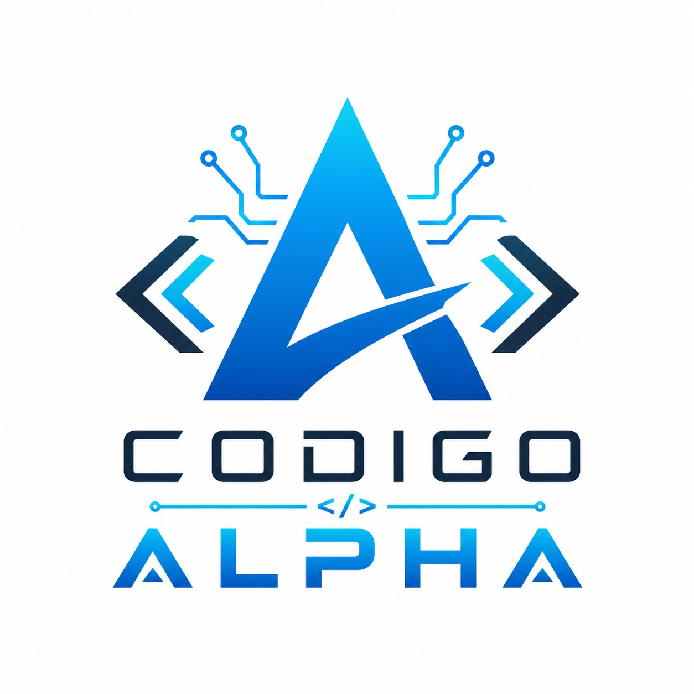

# Codigo Alpha

<p align="center">
  
</p>

## Sobre nosotros
Somos **Codigo Alpha**, un equipo que participa en la **Copa de Algoritmia y Programación UADE 2026**.  
Armamos este repo para organizarnos mientras resolvemos los desafíos.

## Integrantes

- Abad Lucas  
- Albornoz Thiago  
- Sarniguette Valentino  
- Trezeguet Gaston  
- Zaccari Valentin  

---

## Copa de Algoritmia y Programación 2026
Es una competencia donde distintos equipos resuelven desafíos de programación en Python durante varias semanas.

Cada desafío tiene una consigna que hay que implementar y después se evalúa no solo si funciona, sino también:

- que el código sea claro  
- que esté bien organizado  
- que maneje casos borde  
- y que sea eficiente  

Todo se trabaja en equipo y las entregas se hacen por Teams.

---

## Estructura del repo

```
copa-algoritmia-2026/
├── README.md
├── challenges/
├── docs/
└── assets/
```

La carpeta `challenges/` contiene los desafíos, `docs/` se usa para anotaciones y `assets/` guarda recursos como el logo.