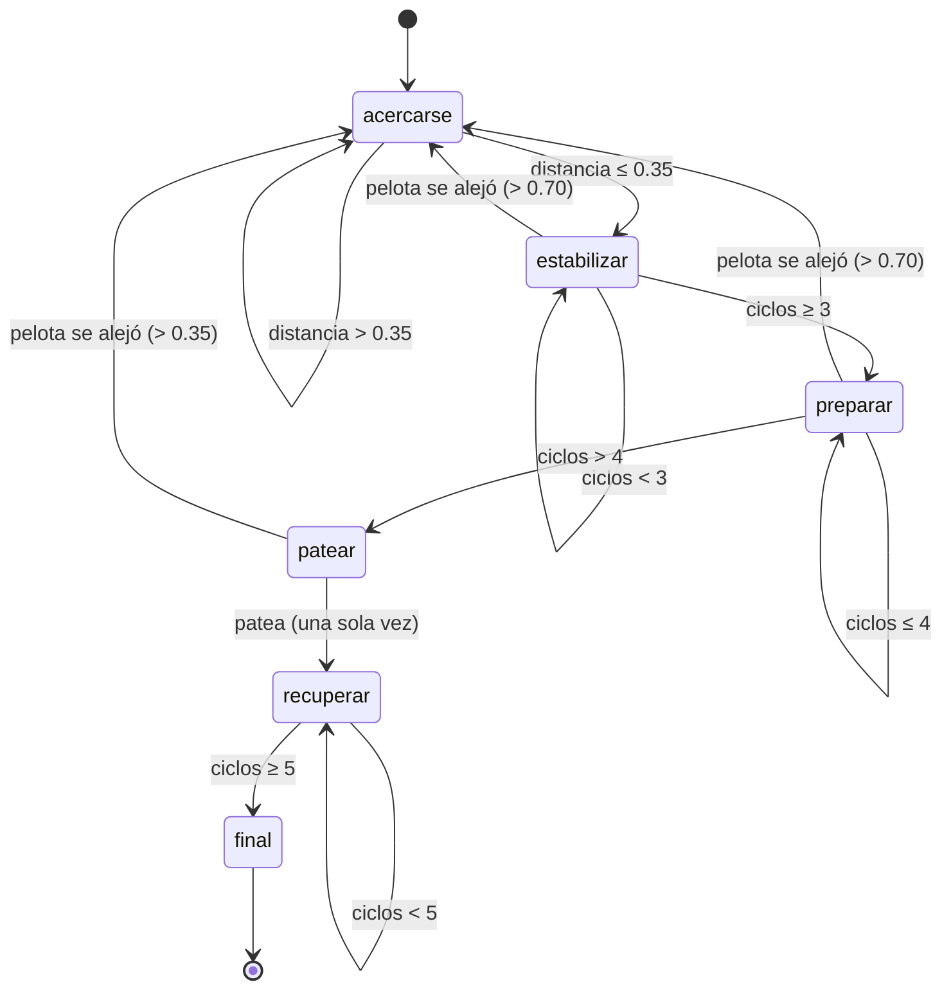

# ⚽ Desafío 4 — El Robot Goleador

> **Copa de Algoritmia y Programación · UADE 2026**
> Estrategia de control para el robot humanoide **G1**: localizar la pelota, aproximarse con estabilidad y ejecutar una patada hacia el arco rival.

---

## 📑 Índice

- [Descripción general](#-descripción-general)
- [Cómo funciona la evaluación](#-cómo-funciona-la-evaluación)
- [La máquina de estados](#-la-máquina-de-estados)
- [Constantes](#-constantes)
- [Variables globales de estado](#-variables-globales-de-estado)
- [Funciones auxiliares](#-funciones-auxiliares)
- [Funciones de fase](#-funciones-de-fase)
- [Función principal `control(robot)`](#-función-principal-controlrobot)
- [API del robot que usa la estrategia](#-api-del-robot-que-usa-la-estrategia)
- [Cómo probarlo localmente](#-cómo-probarlo-localmente)
- [Notas y advertencias](#-notas-y-advertencias)

---

## 🎯 Descripción general

El robot **no recibe una secuencia fija de movimientos**. En cada llamada observa el entorno y decide qué hacer. La estrategia resuelve el problema con una **máquina de estados**: cada "fase" representa una etapa de la jugada, y al terminar una fase se decide cuál sigue.

El recorrido normal de la jugada es:

```
acercarse → estabilizar → preparar → patear → recuperar → final
```

En cualquier momento, si el robot detecta que **se está cayendo**, prioriza recuperar el equilibrio antes de seguir (Tarea 1).

---

## ⚙️ Cómo funciona la evaluación

- La entrega es **un único archivo `.py`** que define **obligatoriamente** la función `control(robot)`.
- El simulador oficial **llama a `control(robot)` muchas veces** durante la ejecución. Ese es el "reloj" del programa.
- Por eso `control()` hace **una sola acción por llamada y termina**: el avance en el tiempo lo da la repetición, no un bucle interno.
- **No se usa** `input()`, ni `time.sleep()`, ni bucles infinitos, ni librerías externas. Solo Python estándar.
- El estado entre llamadas se conserva con **variables globales** (`fase`, contadores, `pateado`).

---

## 🔄 La máquina de estados



> 🛑 **Regla transversal:** desde *cualquier* fase, si el robot está cayendo, se ejecuta `pararse()` y la fase **no cambia** (se reintenta en la próxima llamada). Esto se logra porque las funciones de fase devuelven `None` cuando el robot cae, y `control()` solo actualiza la fase cuando el retorno **no** es `None`.

---

## 🔢 Constantes

| Constante | Valor | Para qué sirve |
|---|---|---|
| `DISTANCIA_PATADA` | `0.35` | Distancia horizontal a la que se considera que el robot está en **zona de golpe**. |
| `DISTANCIA_CERCA` | `0.70` | Umbral de "cerca": dentro de este radio el robot camina **lento**; fuera, camina **rápido**. |
| `VELOCIDAD_RAPIDA` | `1.0` | Velocidad de caminata cuando la pelota está lejos. |
| `VELOCIDAD_LENTA` | `0.4` | Velocidad reducida al estar cerca, para no pasarse de largo ni perder estabilidad. |
| `CICLOS_ESTABILIZAR` | `3` | Cuántas llamadas se queda quieto estabilizándose antes de preparar la patada. |
| `CICLOS_PREPARACION` | `4` | Cuántas llamadas dura la fase de preparación de la patada. |
| `CICLOS_RECUPERACION` | `5` | Cuántas llamadas se queda recuperando postura después de patear. |

---

## 🧠 Variables globales de estado

Se conservan entre las múltiples llamadas a `control()`:

| Variable | Valor inicial | Significado |
|---|---|---|
| `fase` | `"acercarse"` | Fase actual de la máquina de estados. |
| `contador_estabilizar` | `0` | Lleva la cuenta de ciclos en la fase *estabilizar*. |
| `contador_preparacion` | `0` | Lleva la cuenta de ciclos en la fase *preparar*. |
| `contador_recuperacion` | `0` | Lleva la cuenta de ciclos en la fase *recuperar*. |
| `pateado` | `False` | Evita patear más de una vez por jugada (la patada se ejecuta una sola vez). |

---

## 🧩 Funciones auxiliares

### `calcular_distancia_horizontal(posicion_robot, posicion_pelota)`

Calcula la distancia horizontal entre robot y pelota usando **solo x e y** (ignora la altura `z`).

**Parámetros**

| Parámetro | Tipo | Descripción |
|---|---|---|
| `posicion_robot` | tupla `(x, y, z)` | Posición actual del robot. |
| `posicion_pelota` | tupla `(x, y, z)` | Posición actual de la pelota. |

**Retorna:** una tupla `(distancia, dx, dy)`, donde
`dx = pelota_x − robot_x`, `dy = pelota_y − robot_y` y `distancia = √(dx² + dy²)`.

---

### `verificar_estado_y_obtener_datos(robot)`

Función "todo en uno" que combina las Tareas 1 a 4: chequea estabilidad y, si está estable, junta los datos del entorno.

**Comportamiento**

1. Lee `robot.estado_torso()` y toma la bandera `cayendo` (asume `torso[3]`, ver [Notas](#-notas-y-advertencias)).
2. Si está cayendo → ejecuta `robot.pararse()` y devuelve `None`.
3. Si está estable → lee posiciones y calcula la distancia.

**Parámetros**

| Parámetro | Tipo | Descripción |
|---|---|---|
| `robot` | objeto del simulador | Expone los métodos del desafío. |

**Retorna**

- `None` si el robot está cayendo.
- En caso contrario, la tupla `(posicion_robot, posicion_pelota, distancia, dx, dy)`.

---

### `decidir_fase_por_distancia(distancia)`

Decide la siguiente fase comparando la distancia contra `DISTANCIA_PATADA`.

**Parámetros**

| Parámetro | Tipo | Descripción |
|---|---|---|
| `distancia` | número | Distancia horizontal a la pelota. |

**Retorna:** `"acercarse"` si la pelota está lejos, `"estabilizar"` si ya está en zona de patada.

> ℹ️ **Nota:** esta función documenta la lógica de decisión, pero en el flujo actual esa decisión está **inline** dentro de `fase_acercarse`. O la enganchás en el flujo, o conviene quitarla para no dejar código sin uso.

---

## 🦿 Funciones de fase

Todas reciben el objeto `robot` y devuelven el **nombre de la próxima fase** (o `None` si el robot estaba cayendo, para que la fase no cambie).

### `fase_acercarse(robot)` — Tarea 5

Camina hacia la pelota. Usa velocidad **lenta** si está dentro de `DISTANCIA_CERCA`, **rápida** si está más lejos.

| Retorno | Cuándo |
|---|---|
| `None` | El robot estaba cayendo. |
| `"estabilizar"` | Ya llegó a zona de patada (`distancia ≤ DISTANCIA_PATADA`). |
| `"acercarse"` | Debe seguir caminando. |

---

### `fase_estabilizar(robot)` — Tarea 6 (parte 1)

Mantiene al robot quieto con `pararse()` durante `CICLOS_ESTABILIZAR` llamadas, para llegar firme a la patada.

| Retorno | Cuándo |
|---|---|
| `None` | El robot estaba cayendo. |
| `"acercarse"` | La pelota volvió a quedar lejos (`> DISTANCIA_CERCA`). |
| `"estabilizar"` | Sigue contando ciclos. |
| `"preparar"` | Completó los ciclos de estabilización. |

---

### `fase_preparar_patada(robot)` — Tarea 6 (parte 2)

Reparte la preparación en pasos: primero unos ciclos quieto, después `inclinarse()` + `preparar_patada()` para transferir el peso y cargar la pierna.

| Retorno | Cuándo |
|---|---|
| `None` | El robot estaba cayendo. |
| `"acercarse"` | La pelota quedó lejos. |
| `"preparar"` | Sigue preparando. |
| `"patear"` | Terminó la preparación. |

---

### `fase_patear(robot)` — Tarea 7

Ejecuta la patada **una sola vez** (controlado por `pateado`) y solo si sigue en zona de golpe.

| Retorno | Cuándo |
|---|---|
| `None` | El robot estaba cayendo. |
| `"acercarse"` | La pelota se alejó (`> DISTANCIA_PATADA`). |
| `"recuperar"` | Pateó (o ya había pateado). |

---

### `fase_recuperar(robot)` — Tarea 8

Después del golpe, llama a `pararse()` durante `CICLOS_RECUPERACION` llamadas para no caerse tras patear.

| Retorno | Cuándo |
|---|---|
| `"recuperar"` | Sigue recuperando postura. |
| `"final"` | Terminó la recuperación. |

---

## 🎮 Función principal `control(robot)`

Es la **única función obligatoria** de la entrega. El simulador la llama repetidamente. Funciona como un *despachador*: según la `fase` actual, llama a la función de fase correspondiente y actualiza la fase con el resultado.

```python
def control(robot):
    global fase

    if fase == "acercarse":
        nueva_fase = fase_acercarse(robot)
    elif fase == "estabilizar":
        nueva_fase = fase_estabilizar(robot)
    elif fase == "preparar":
        nueva_fase = fase_preparar_patada(robot)
    elif fase == "patear":
        nueva_fase = fase_patear(robot)
    elif fase == "recuperar":
        nueva_fase = fase_recuperar(robot)
    elif fase == "final":
        robot.pararse()
        nueva_fase = "final"
    else:
        robot.pararse()
        nueva_fase = "acercarse"

    if nueva_fase != None:
        fase = nueva_fase
```

**Punto clave:** la fase solo se actualiza si `nueva_fase` **no** es `None`. Así, cuando el robot se cae (las funciones devuelven `None`), se queda en la misma fase y la reintenta tras recuperarse.

---

## 🤖 API del robot que usa la estrategia

| Método | Qué hace | Dónde se usa |
|---|---|---|
| `posicion_robot()` | Devuelve `(x, y, z)` del robot. | `verificar_estado_y_obtener_datos` |
| `posicion_pelota()` | Devuelve `(x, y, z)` de la pelota. | `verificar_estado_y_obtener_datos` |
| `estado_torso()` | Devuelve altura, pitch, roll y la bandera `cayendo`. | chequeo de estabilidad |
| `pararse()` | Postura estable de pie con corrección de balance. | inicio, estabilizar, recuperar, recuperación de caídas |
| `caminar(velocidad)` | Camina con locomoción preentrenada. | `fase_acercarse` |
| `inclinarse(adelante, lateral)` | Inclina el torso para transferir peso. | `fase_preparar_patada` |
| `preparar_patada(pierna, fuerza)` | Carga la pierna para el golpe. | `fase_preparar_patada` |
| `patear(pierna, potencia)` | Ejecuta la extensión de la pierna. | `fase_patear` |

---

## 🧪 Cómo probarlo localmente

El simulador oficial reemplaza al objeto `robot`. Para probar en tu compu sin el simulador, se usa un **robot de mentira (mock)** y un archivo de prueba que llama a `control()` en un bucle. Ese andamiaje **no se entrega** (va aparte, por ejemplo en la carpeta `prueba/`).

```bash
# Mac / Linux
python3 prueba/test_local.py

# Windows
python prueba\test_local.py
```

Solo se sube a Teams el archivo con la estrategia (`CodigoPrincipal.py`), que contiene únicamente la función `control(robot)` y sus auxiliares.

---

## ⚠️ Notas y advertencias

- **Formato de `estado_torso()`:** el código asume que devuelve una **tupla** y lee la bandera como `torso[3]`. Confirmá contra el `robot_api.py` real que efectivamente sea una tupla `(altura, pitch, roll, cayendo)`. Si fuera un diccionario o un objeto, esa línea hay que cambiarla (por `torso["cayendo"]` o `torso.cayendo`). Es el punto más frágil de toda la estrategia.
- **Ciclos a ojo:** `CICLOS_ESTABILIZAR`, `CICLOS_PREPARACION` y `CICLOS_RECUPERACION` son valores elegidos a mano. Si en las pruebas oficiales el robot patea inestable o se cae después del golpe, conviene subirlos.
- **`decidir_fase_por_distancia` sin uso:** está definida pero no se llama en el flujo actual (ver su nota arriba).
- **Coherencia de umbrales:** `fase_acercarse` salta a *estabilizar* con `≤ DISTANCIA_PATADA` (0.35), pero las demás fases vuelven a *acercarse* con `> DISTANCIA_CERCA` (0.70). El "colchón" entre 0.35 y 0.70 evita que el robot oscile entre fases por pequeños movimientos.

---

*Documento generado para el repositorio `copa-algortimia-2026`, módulo `challenges/desafio_final/posicion`.*